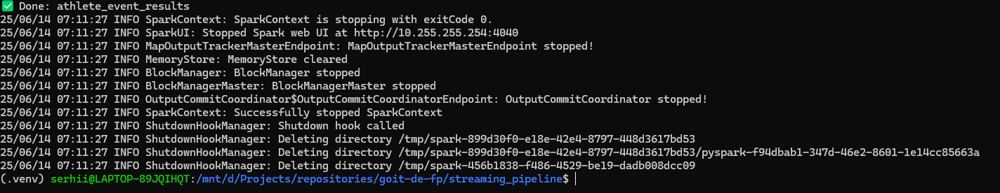
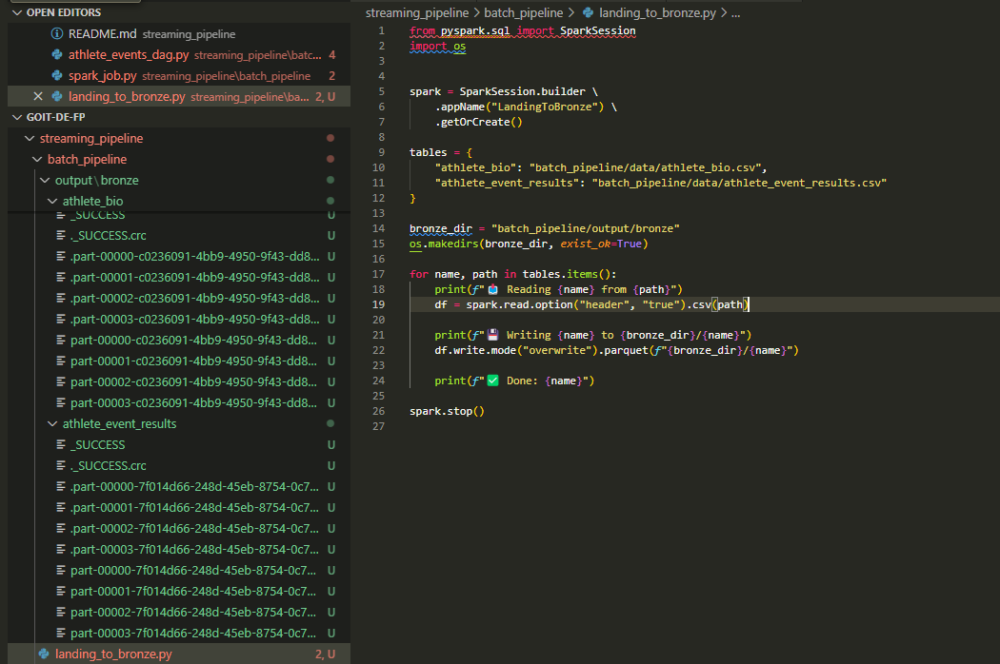
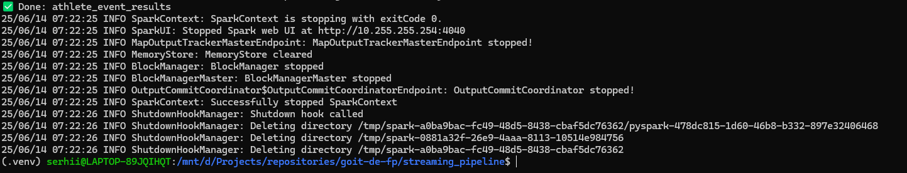
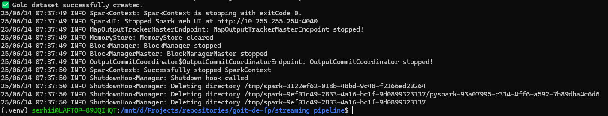
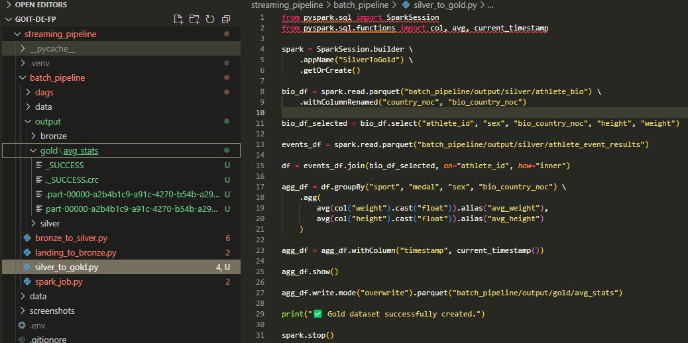
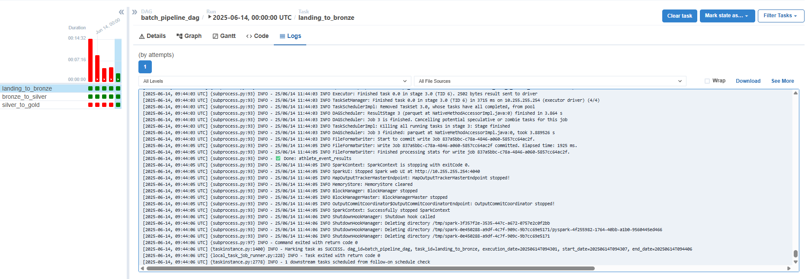
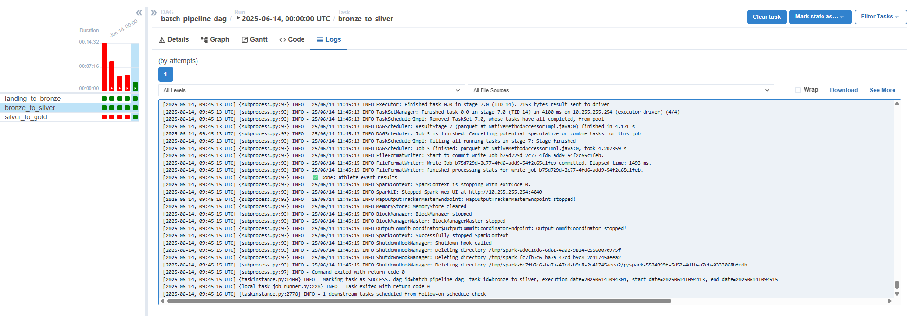
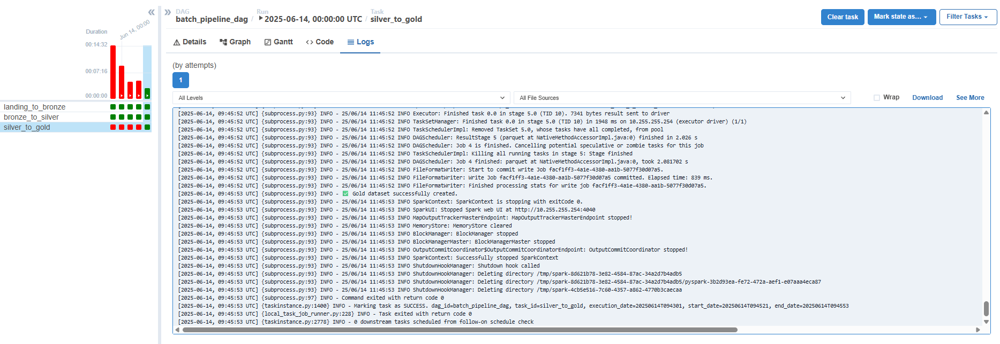
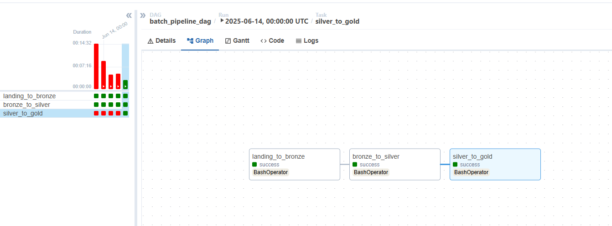

# 🏋️‍♂️ Athlete Performance Pipeline (Batch + Streaming)

This project is the final assignment for the **Data Engineering course**, combining:

- Batch data processing (Apache Spark)
- Streaming data ingestion (Apache Kafka)
- Multi-layer architecture (Landing → Bronze → Silver → Gold)
- Automation with Apache Airflow

---

## 🧭 Project Overview

The project is divided into two main parts:

- **Streaming Pipeline** – handles real-time data ingestion using Kafka (producer logic and topic management)
- **Batch Pipeline** – performs ETL using PySpark, orchestrated with Airflow

This repository includes both parts, but the `batch_pipeline/` folder focuses specifically on batch processing and automation logic.

---

## 📁 Project Structure

```
goit-de-fp/
├── streaming_pipeline/
│ ├── batch_pipeline/
│ │ ├── landing_to_bronze.py
│ │ ├── bronze_to_silver.py
│ │ ├── silver_to_gold.py
│ ├── dags/
│ │ ├── batch_pipeline.py
│ ├── data/
│ │ ├── athlete_bio.csv
│ │ ├── athlete_event_results.csv
│ ├── output/
│ │ ├── bronze/
│ │ ├── silver/
│ │ ├── gold/
│ ├── spark_job.py
├── README.md

```

---

## 🛠️ Batch Pipeline (ETL)

The pipeline consists of three main processing stages:

1. `landing_to_bronze.py` — reads CSV files from `data/` and stores them as Parquet in `bronze/`
2. `bronze_to_silver.py` — joins and cleans data, outputs to `silver/`
3. `silver_to_gold.py` — performs aggregation (e.g., weight, height stats) and saves to `gold/avg_stats/`

Execution is automated via the DAG `batch_pipeline.py`.

---

## 🖥️ Screenshots & Execution Examples

| Stage                 | Description           | Screenshot                                                           |
| --------------------- | --------------------- | -------------------------------------------------------------------- |
| Docker                | Container check       |                |
| Kafka Topics          | Listing topics        |        |
| Producer              | Sending messages      |         |
| Kafka kcat            | Message inspection    |            |
| Bronze                | Bronze layer creation |                   |
| Bronze folder         | Directory contents    |            |
| Bronze → Silver       | Transformation step   |         |
| Silver folder         | Silver Parquet files  |  |
| Silver → Gold         | Aggregation           |           |
| Gold folder           | Gold Parquet files    |    |
| DAG: landing → bronze | Logs                  |   |
| DAG: bronze → silver  | Logs                  |    |
| DAG: silver → gold    | Logs                  |      |
| DAG Graph             | DAG visualization     |                    |

---

## 🔄 Airflow Automation

- The DAG `batch_pipeline.py` orchestrates all Spark jobs sequentially.
- Each task runs via `BashOperator` using `spark-submit`.

---

## 📌 Notes

- Dataset: [athlete_events.csv](https://www.kaggle.com/datasets/heesoo37/120-years-of-olympic-history-athletes-and-results)
- Spark runs in local mode (no YARN).
- Kafka is used for streaming (partially implemented).
