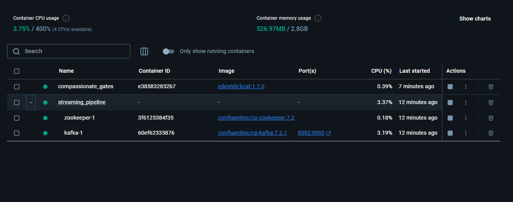
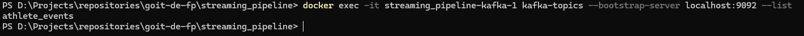
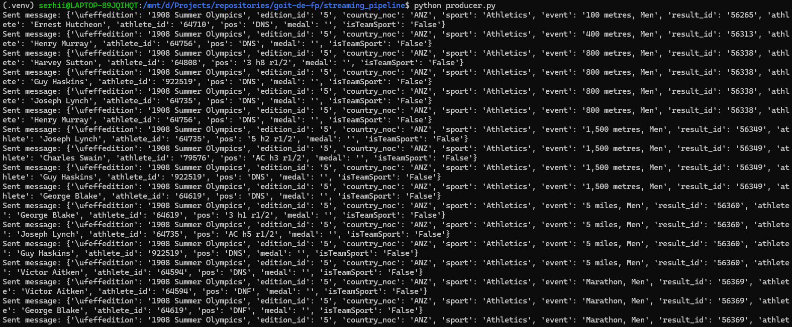
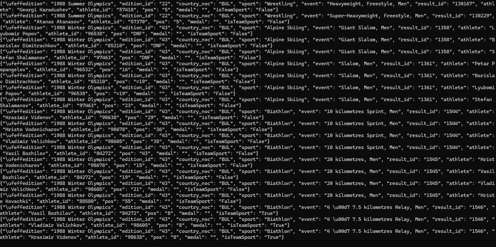

# 🌀 Kafka Streaming Pipeline — Final Project (Part 1)

This is the first part of the final data engineering project: a **streaming data pipeline** using:

- 🐍 Python (Kafka producer)
- 🐘 Apache Kafka (Docker containerized)
- 🐳 Docker Compose
- 📬 Kafka topic: `athlete_events`
- 🔎 kcat (Kafka consumer) to verify messages

---

## ✅ Pipeline Overview

1. **Python script `producer.py`** reads a CSV and sends messages to Kafka topic `athlete_events`.
2. **Kafka/Zookeeper** run inside Docker containers.
3. **kcat** is used to consume and verify messages from the topic.

---

## 🖼️ Screenshots

| Step | Description                      | Screenshot                                |
| ---- | -------------------------------- | ----------------------------------------- |
| 1    | Docker containers running        |          |
| 2    | Kafka topic listed               |  |
| 3    | Python producer sending events   |   |
| 4    | Consuming JSON messages via kcat |      |

---

## 🚀 How to Run

```bash
# Start Kafka & Zookeeper
docker-compose up -d

# Run producer
python producer.py

# Consume messages (from another terminal)
docker run --rm -it --network streaming_pipeline_default edenhill/kcat:1.7.0 \
  kcat -b streaming_pipeline-kafka-1:9092 -t athlete_events -C
```
